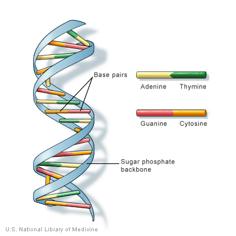
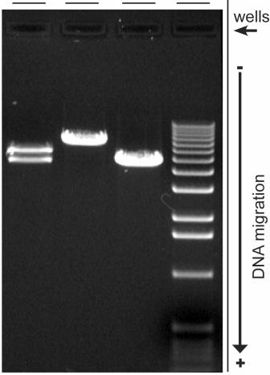
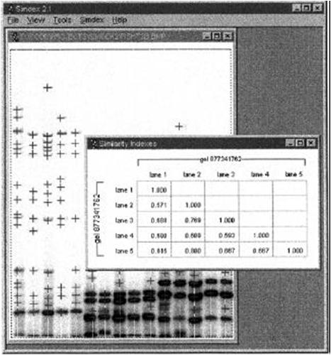

DNA Recognition for Biometric Identification
==================================================================

INTRODUCTION
--------------------------------------

DNA Recognition is a part of Biometric Identification and Verification technique used to identify human individuals by identifying the distinctiveness in their DNA profiles. This process is also called as DNA Fingerprinting or DNA Profiling.
As it is clear from its Greek root, Bio to mean Life and Metriko to mean Measure, Biometrics is the process of identifying individuals based on their physiological and behavioural characteristics.
Biometric Systems work in a way that physiological characteristics such as Fingerprint, Iris, DNA, Face and behavioural characteristics such as Hand Signature, Voice and Gestures are recorded using certain sensors and thereafter prominent features are extracted and stored in databases which are then used for Verification and Identification purposes. [1]
Biometric Authentication is a process where an individual who is Verified and Identified using the above described methods, is given an access to the resources which are protected.
The following sections in this paper describe the insight of DNA Fingerprinting, the laboratorial procedures for DNA extraction and analysis, Pattern Matching, Software and Databases available.

 

AUTHOR
--------------------------------------
- Aravinth Panchadcharam
- Mouaz Al-Qudsi

ACKNOWLEDGEMENTS
--------------------------------------
- Deutsche Telekom - Telekom Innovation Laboratories (T-Labs)
- Prof. Sebastian Möller - Quality and Usability Lab

DNA Fingerprinting
--------------------------------------

It gained considerable attention in 1984 after Sir Alec Jeffreys [2] delivered the possible mean for assessing the variations in the DNA in natural and domesticated populations.
Thereafter DNA Fingerprinting is been used by the forensic laboratories for criminal forensics and paternity testing around the world since it is one of the highly reliable biometric system available.

Significances of DNA Recognition are given below

- Universality: Since every human is consisting of DNA, It has high universality.
- Distinctiveness: It’s highly distinct; except in the case of identical twins.
- Stability: It is considered to be highly stable because DNA doesn’t change with the age.
- Collectability: Due to strict regulations DNA samples are not collected and stored as in other biometric systems.
- Performance: It has high performance and accuracy with the help of various technologies
- Acceptability: It is not commonly accepted by the people due to the fact that DNA could reveal more than just their identity.

Materials and Methods
--------------------------------------
### DNA – Deoxyribonucleic Acid

Deoxyribonucleic Acid is a molecule that encodes the genetic instructions used in the development and functioning of all known living organisms and many viruses. DNA is one of the three major macromolecules essential for all known forms of life. Genetic information is encoded as a sequence of nucleotides (guanine, adenine, thymine, and cytosine) recorded using the letters G, A, T, and C. [3]
Even though DNA Sequences of human being are almost 99.9% similar, it helps to distinguish one individual from another with an exception of Identical twins. Variable Tandem Repeats (VNTR) and Short Tandem Repeats (STR) [2] in a DNA sequence are highly variable to unrelated individuals and very much similar to closely related people. DNA Recognition process is completely relied on to these repeats to identify individuals.

### Extraction
STR fragments are extracted from the samples by following the procedures which are given below.

- Samples such as blood, hair, skin tissue are collected
- DNA is extracted from the collected sample
- DNA is cut at specific points along the strand using restriction enzyme to obtain the STR which are also called as Mini-satellites. This process is called as Restriction Fragment Length Polymorphism (RFLP) Analysis. [4]

### Electrophoresis

This process contains the below given procedures and yields to the result that will be stored as an Image where the distances travelled by the fragments can be calculated.

- Fragmented DNA of samples are deposited into the wells or lanes created in the Agarose gel
- Both ends of the gel are connected to electrodes applying positive and negative voltage respectively
- DNAs are negatively charged. Hence the fragments in the sample start to move towards the positive electrodes
- The molecular weights of the fragments vary with each other. Therefore the fragments migrate at different speed

Various Analyses such as Polymerase Chain Reaction (PCR) and Amplified Fragment Length Polymorphism (AmpFLP) can be carried out to achieve this result.

 

### Pattern Matching

The distances travelled by STR fragments are recorded as Bands and the similarity between the bands of various samples are calculated. DNA can be recognized by calculating the Similarity Index between the samples. Similarity Index [7] is a number of common fragments in DNA fingerprinting profile of individual x and y, divided by the average number of fragments exhibited by both individual. The Similarity index is given by Equation 1:

Where is the total number of Fragments in x, is the total number of Fragments in y and is number of similar bands in x and y.

DNA Fingerprinting Software and Databases
--------------------------------------

### DNA Simdex

DNA Simdex [5] is a computer program implemented by University of Hong Kong that uses sophisticated image-analysis techniques to automatically locate bands on electrophoresis gel images and calculate similarity indexes. Similarity indexes for any set of lanes on a single gel or on different gels can be calculated using this Software.
Simdex2.1 displays band migration lengths, molecular weight and calculated similarity indexes in tabular displays.

 

### Databases
An initiative by FBI [6] to look for new scientific advances to increase the range and quality of biometric identification capabilities established few databases which can be accessed by the forensic laboratories.

- CODIS - Combined DNA Index System is the generic term used to describe the FBI’s program of support for criminal justice DNA databases as well as the software used to run these databases.
- NDIS - National DNA Index System is considered one part of CODIS, the national level, containing the DNA profiles contributed by federal, state, and local participating forensic laboratories.

References
--------------------------------------
1. K. Delac, M. Grgic - A survey of biometric recognition methods. ISBN - 953-7044-02-5
2. A. J. JEFFREYS, V. WILSON & S. L. THEIN - Individual-specific fingerprints of human DNA. 1985.
3. DNA - http://en.wikipedia.org/wiki/DNA
4. Saiki, RK; Scharf S, Faloona F, Mullis KB, Erlich HA, Arnheim N (Dec 20 1985). "Enzymatic amplification of beta-globin genomic sequences and restriction site analysis for diagnosis of sickle cell anemia". Science 230 (4732): 1350–1354.
5. E. Scott Archer and Frederick C. Leung - Computer Program for Automatically Calculating Similarity Indexes from DNA Fingerprints. Bio Techniques 25:252-254. 1998
6. FBI – The Federal Bureau of Investigations- Fingerprints & Biometrics, CODIS & NDIS Databases.www.fbi.gov/aboutus/cjis/fingerprints_biometrics
7. Michael Lynch - The Similarity Index and DNA Fingerprinting. Mol. Biol. Evol. 7(5):478-484. 1990.

